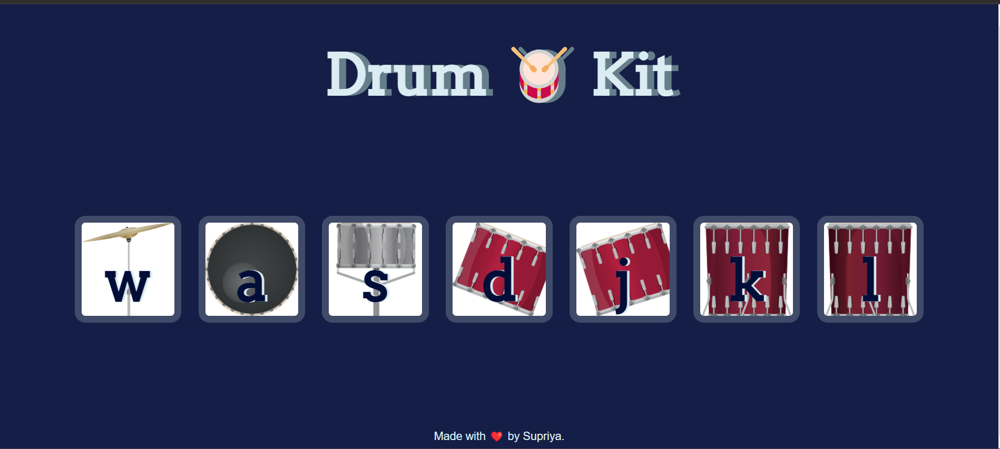

# 🥁 Drum Kit Website 

Welcome to the Drum Kit website! This interactive web application allows you to play various drum sounds by simply clicking or tapping on the virtual drum pads. It's a fun and engaging way to explore rhythm and percussion.

## 🌍 [Live Demo](https://play-drum-kit1.netlify.app/)

Click the link above to experience the live version of the Drum Kit website.

## 🔧 Features

- **Interactive Design**: Play the drums using your keyboard keys.
- **Responsive**: Suitable for both desktop and mobile users.
- **High-Quality Sounds**: Realistic drum sounds to enhance your playing experience.

## Technologies Used

- HTML5
- CSS3
- JavaScript

## Usage

1. Visit the live website [here](https://play-drum-kit1.netlify.app/).
2. Click or tap on the drum pads to trigger the drum sounds.
3. Experiment with different rhythms and beats.
4. Enjoy your drumming experience!
